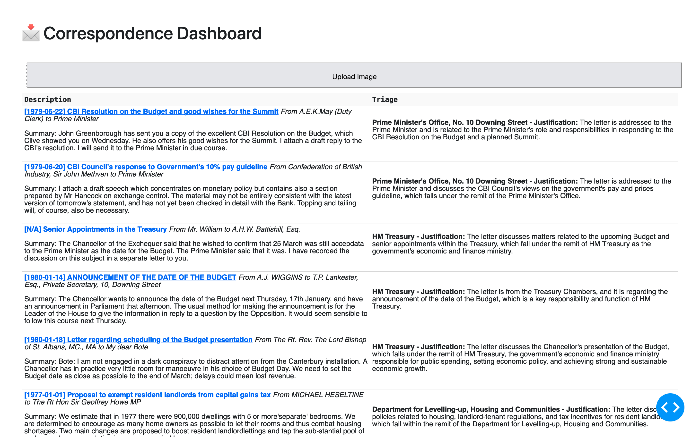

# 📩 No10 Hackathon - Correspondence triage support tool 

This repository contains the code written for the No10 Hackathon challenge on triaging handwritten ministerial correspondence.   
To get started with the project:
```
pip install -r requirements.txt
python app.py
```

The project also requres a specific setup on GCP and Firebase, as well as an Anthropic API key. Because of limited time when building this process, the project does not create these setups programmatically and this will probably break launch when you try it out.

## Features

 - User interface displaying all processed letters and to upload 
 - Automatic transcription of handwritten letter pictures
 - Extraction of metadata from letter transcript: sender, recipient, data sent, ...
 - Automatic subject and summary generation
 - Automatic triage recommendation: who should the letter be transferred to and why?

## Technologies  
  
- **[Anthropic Claude 3 Hiku](https://www.anthropic.com/news/claude-3-family)** for thr visual processing of handwritten mail, metadata extraction, and triage recommendation.  
- **[Dash](https://github.com/plotly/dash)** for the presentation of the dashboard. It is arguably not the most suitable tool to build the kind of frontend we were after, but it was one I knew back then and was able to quickly iterate with.  
- **[Google Cloud Storage](https://cloud.google.com/storage)** bucket for the letter images.  
- **[Firestore](https://firebase.google.com/docs/database)** for the database, storing the information associated to each letter. 

## Screenshot



## Contributors

This repo is the result of joint work in my team at the No10 GenAI Hackathon that took place at Imperial College in April 2024. The team was composed of:
 - James Kenyon
 - Isabella Farrington
 - Sarah Stapleton
 - Paul Festor